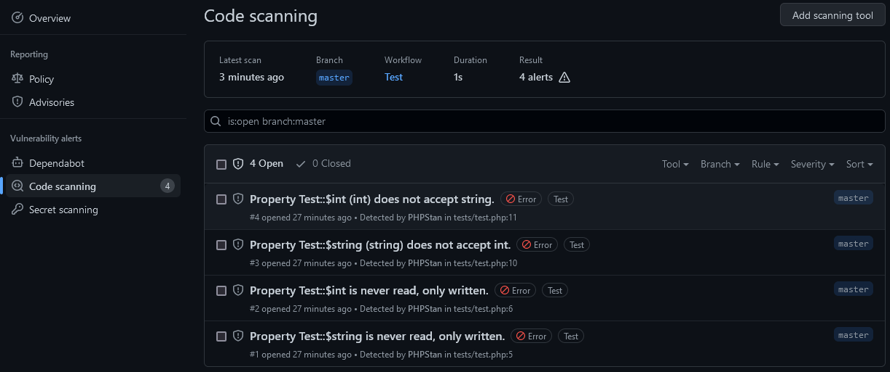

# SARIF formatter for PHPStan

🔖 **Compatible with PHPStan 1.x and 2.x**

## PHPStan

PHPStan focuses on finding errors in your code without actually running it. It catches whole classes of bugs even before you write tests for the code. It moves PHP closer to compiled languages in the sense that the correctness of each line of the code can be checked before you run the actual line.

<https://phpstan.org/>

## Static Analysis Results Interchange Format (SARIF)

SARIF, the Static Analysis Results Interchange Format, is a standard, JSON-based format for the output of static analysis tool.  
It has been [approved](https://www.oasis-open.org/news/announcements/static-analysis-results-interchange-format-sarif-v2-1-0-is-approved-as-an-oasis-s) as an [OASIS](https://www.oasis-open.org/) standard.

SARIF is a rich format intended to meet the needs of sophisticated tools, while still being practical for use by simpler tools.
Because it would be impractical to support every feature of every tool, SARIF provides an extensibility mechanism to allow tool authors to store custom data that the SARIF format doesn't directly represent.

<https://docs.oasis-open.org/sarif/sarif/v2.0/sarif-v2.0.html>

## Usage

```cmd
composer require --dev phpstan/phpstan jbelien/phpstan-sarif-formatter
```

Then update your `phpstan.neon` configuration file:

```yaml
services:
    errorFormatter.sarif:
        class: PHPStanSarifErrorFormatter\SarifErrorFormatter
        arguments:
            relativePathHelper: @simpleRelativePathHelper
            currentWorkingDirectory: %currentWorkingDirectory%
            pretty: true
```

## GitHub Code Scanning

Documentation: <https://docs.github.com/en/code-security/code-scanning/automatically-scanning-your-code-for-vulnerabilities-and-errors/about-code-scanning>

GitHub Code Scanning features are compatible with SARIF.  
The SARIF Formatter for PHPStan allows you to use PHPStan as GitHub Code Scanning tool.

To use in one of your GitHub Actions workflows, add the following in your job:

```yaml
- name: Run PHPStan
  continue-on-error: true
  run: phpstan analyze --error-format=sarif > phpstan-results.sarif

- name: Upload analysis results to GitHub
  uses: github/codeql-action/upload-sarif@v2
  with:
    sarif_file: phpstan-results.sarif
    wait-for-processing: true
```

It will display PHPStan error messages in your PR (check [this PR](https://github.com/jbelien/phpstan-sarif-formatter/pull/1)) and add alerts in the "Code scanning" report in "Security" tab of your project (see screenshot below).


